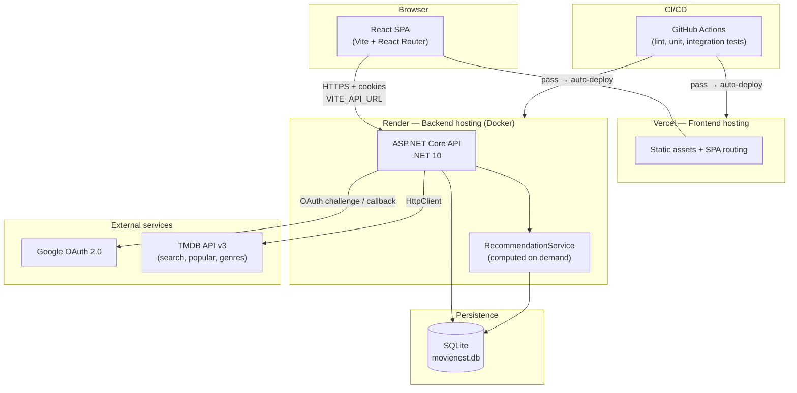
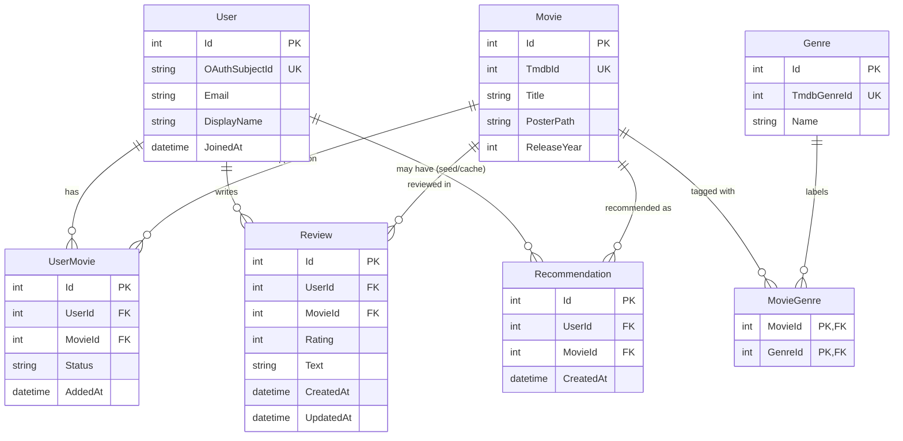
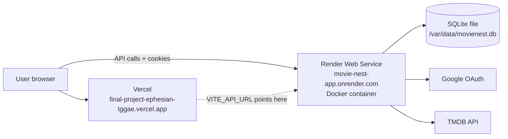

# MovieNest Architecture

MovieNest is a community movie platform: users sign in with Google, manage watchlists and watch history, write reviews, search TMDB, and receive personalized recommendations. The app is a **React SPA** talking to an **ASP.NET Core API** backed by **SQLite**, deployed as **Vercel (frontend) + Render (backend)**.

There is **no real-time layer** (no SignalR, WebSockets, or MCP). The advanced integration is **Option C — a recommendation engine** that computes suggestions on demand from user history, genre preferences, and community activity.

---

## System architecture

### Request flow (typical signed-in action)

1. User opens the Vercel-hosted SPA; React Router renders a page.
2. Protected pages call `GET /api/me` (with credentials) to confirm the session cookie.
3. Mutations (watchlist, reviews) go to Render over HTTPS with `credentials: 'include'`.
4. The API resolves the current user from the cookie, scopes queries to that user, and reads/writes SQLite.
5. Movie search and popular lists call TMDB; results may be persisted locally when added to a shelf or review.

---

## Frontend route map

Routes are defined in `frontend/src/App.jsx`. Protected routes wrap page components in `ProtectedRoute`, which redirects anonymous users to `/`.

| Path | Component | Access | Purpose |
|------|-----------|--------|---------|
| `/` | `Home` | Public | Landing page, sign-in entry point |
| `/discover` | `Discover` | Public | Browse popular movies and recommendations preview |
| `/watchlist` | `Watchlist` | Protected | View and manage movies to watch |
| `/history` | `History` | Protected | View watched movies |
| `/reviews` | `Reviews` | Protected | Create, edit, and delete reviews |
| `/profile` | `Profile` | Protected | View signed-in user profile |
| `/settings` | `Settings` | Protected | Account settings |
| `/search` | `Search` | Protected | Search TMDB and add movies |

**Auth behavior:** Sign-in redirects the browser to `GET /api/auth/login` on the API, which challenges Google OAuth. After success, the API sets an HTTP-only cookie and redirects to `FrontendUrl`. Logout calls `POST /api/auth/logout`.

---

## Backend endpoint table

All JSON endpoints live in `backend/Program.cs`. Protected routes use `.RequireAuthorization()` and return **401** when no valid session cookie is present. Resource endpoints additionally return **403** when the authenticated user does not own the record.

| Method | Path | Access | Description |
|--------|------|--------|-------------|
| GET | `/` | Public | Plain-text API status message |
| GET | `/api/health` | Public | Health check (`status`, `app`, `timeUtc`) |
| GET | `/api/public/stats` | Public | Aggregate counts (movies, members, activity) |
| GET | `/api/public/movies/popular` | Public | Popular movies from TMDB |
| GET | `/api/public/movies/search?q=` | Public | TMDB movie search (anonymous) |
| GET | `/api/public/genres` | Public | Genre list from local database |
| GET | `/api/auth/login` | Public | Starts Google OAuth challenge |
| POST | `/api/auth/logout` | Public | Clears session cookie |
| POST | `/api/auth/e2e-login` | Dev only | Playwright test login when `E2E_AUTH_ENABLED=true` |
| GET | `/api/me` | Protected | Current user email and name |
| GET | `/api/watchlist` | Protected | User's watchlist items |
| POST | `/api/watchlist` | Protected | Add movie to watchlist |
| PATCH | `/api/watchlist/{id}` | Protected | Mark watchlist item as watched (moves to history) |
| DELETE | `/api/watchlist/{id}` | Protected | Remove watchlist/history entry (owner only) |
| GET | `/api/history` | Protected | User's watched movies |
| GET | `/api/movies/search?q=` | Protected | TMDB search (signed-in) |
| GET | `/api/movies/{tmdbId}/genres` | Protected | Genres for a TMDB movie |
| GET | `/api/recommendations` | Protected | Personalized recommendations (computed on demand) |
| GET | `/api/reviews` | Protected | User's reviews |
| POST | `/api/reviews` | Protected | Create a review |
| PATCH | `/api/reviews/{id}` | Protected | Update own review |
| DELETE | `/api/reviews/{id}` | Protected | Delete own review |

**Swagger:** Available in Development at `/swagger`.

---

## Data model

### Entity-relationship diagram

### Entity summary

| Entity | Role | Key constraints |
|--------|------|-----------------|
| **User** | App member synced from Google OAuth | Unique `OAuthSubjectId` |
| **Movie** | Canonical movie record (from TMDB or manual entry) | Unique `TmdbId` |
| **UserMovie** | Join table for watchlist (`status = "watchlist"`) or history (`"watched"`) | Unique `(UserId, MovieId)` |
| **Review** | User rating (1–5) and optional text for a movie | Unique `(UserId, MovieId)` |
| **Genre** | TMDB genre cached locally | Unique `TmdbGenreId` |
| **MovieGenre** | Many-to-many link between movies and genres | Composite PK `(MovieId, GenreId)` |
| **Recommendation** | Table exists for seed/community data; live API recommendations are **computed** by `RecommendationService` and not persisted per request |

### Recommendation engine (advanced integration)

`RecommendationService` ranks candidate movies using:

- The user's genre weights from watchlist, history, and reviews
- Similar users' activity (collaborative signal)
- Community-wide popularity stats from seeded data

Results are returned from `GET /api/recommendations` without writing scores to the database on each request.

---

## Deployment architecture

### How frontend and backend connect

| Layer | Host | Details |
|-------|------|---------|
| **Frontend** | [Vercel](https://final-project-ephesian-tggae.vercel.app) | Root: `MovieNest-app/frontend`. Build: `npm run build`. `VITE_API_URL` is baked in at build time. |
| **Backend** | [Render](https://movie-nest-app.onrender.com) | Root: `MovieNest-app/backend`. **Docker** image from `backend/Dockerfile` (.NET 10 publish). Listens on Render's `PORT`. |
| **Database** | Render persistent disk | `ConnectionStrings__DefaultConnection` = `Data Source=/var/data/movienest.db` |
| **Auth redirect** | Render env | `FrontendUrl` = Vercel app URL (post-OAuth redirect target) |
| **CORS** | Render env | `Cors__AllowedOrigins__0` = same Vercel URL; `AllowCredentials()` for cookie auth |

### CI/CD pipeline

Push to `main` triggers **GitHub Actions** (`.github/workflows/ci.yml`):

- Backend: restore, build, run xUnit integration tests
- Frontend: ESLint, Vitest unit tests, production build

Vercel and Render auto-deploy from GitHub after a green CI run. Treat Actions as the quality gate before relying on production.

### Environment variables (production)

| Variable | Host | Purpose |
|----------|------|---------|
| `VITE_API_URL` | Vercel | API base URL for the SPA |
| `Authentication__Google__ClientId` | Render | Google OAuth client ID |
| `Authentication__Google__ClientSecret` | Render | Google OAuth secret |
| `Tmdb__ApiKey` | Render | TMDB v3 API key |
| `ConnectionStrings__DefaultConnection` | Render | SQLite path on persistent volume |
| `FrontendUrl` | Render | OAuth redirect + CORS origin |
| `Cors__AllowedOrigins__0` | Render | Allowed frontend origin |
| `SEED_ON_STARTUP` | Render | `true` on first deploy to migrate and seed; `false` afterward |

Local development uses `http://localhost:5173` (frontend) and `http://localhost:5102` (API) with matching CORS and cookie settings in `appsettings.Development.json`.

---

## Key technology choices and rationale

| Choice | Rationale |
|--------|-----------|
| **React + Vite** | Fast dev server, simple SPA build, good fit for a client-rendered movie UI with React Router |
| **ASP.NET Core minimal APIs** | Typed backend, built-in auth middleware, easy integration tests with `WebApplicationFactory` |
| **SQLite + EF Core** | Zero external DB setup locally; single file on Render's disk keeps the class demo deployable on free tier |
| **Google OAuth (cookie sessions)** | Meets course auth requirement; cookies with `SameSite=None` + `Secure` work across Vercel ↔ Render origins |
| **TMDB API** | Authoritative movie metadata (titles, posters, years, genres, search) without maintaining a movie catalog |
| **Recommendation engine (Option C)** | Adds personalized value using existing user and community data; no extra infrastructure vs. real-time or MCP |
| **Render Docker + Vercel** | Render's native stack lacks .NET SDK; Docker runs the published API. Vercel handles static SPA hosting and CDN |
| **xUnit + Vitest + Playwright** | Backend integration tests against real HTTP pipeline; frontend unit tests for components/utils; E2E for critical flows locally |

---

## Related documentation

- [README](../README.md) — setup, env vars, deployment steps
- [DESIGN_NOTE.md](./DESIGN_NOTE.md) — product and design decisions
- [TESTING_REVIEW.md](./TESTING_REVIEW.md) — test strategy and AI review
- [PRODUCT_BRIEF.md](../PRODUCT_BRIEF.md) — Milestone 0 scope
